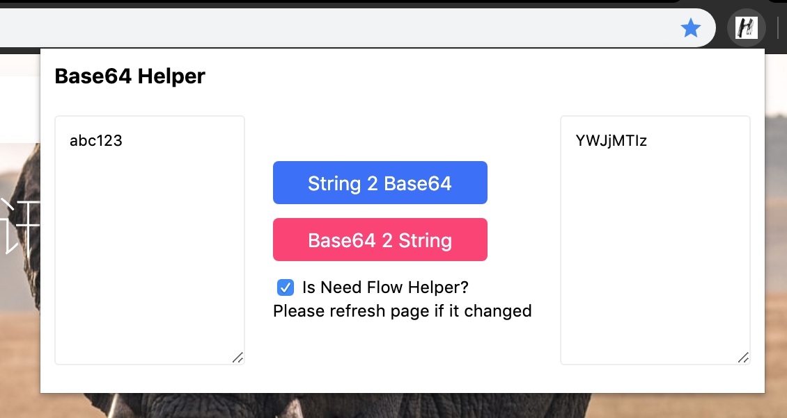
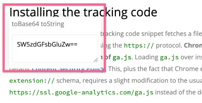

# Base64 helper

A Chrome extension that converts bwtween base64 and string.

## Install

Go to Chrome App Store, search and install `base64-helper`.

## Usage

Open the extension and input any string to convert.

## Flow helper

Click the checkbox to Enable/Disable the flow helper in each page.

## Thanks
